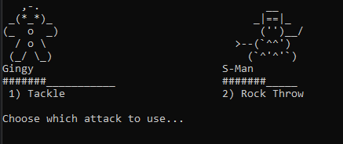

# AsciiMon

```log
_______ _______ _______ _____ _____ _______  _____  __   _
|_____| |______ |         |     |   |  |  | |     | | \  |
|     | ______| |_____  __|__ __|__ |  |  | |_____| |  \_|
```

## How to Run

```bash
cargo run
```

## How to Play

Follow the prompts to select your Asciimon and attacks



## ToDos

- [ ] Make it a rogue like to see how many "waves" you can survive/beat
- [ ] Initial list of all Asciimon from json, csv etc
  - randomize health to 3d6 for enemies. always start with 18 on player
- [x] Make a list of all valid Asciimon
- [x] Have player select which one they want to try their run with
- [x] Make sure all ascii art is same number of lines high
- [ ] Add initiative order
- Attacks
  - [ ] Hard attack has a cool down for X turns
  - [ ] add chance to hit for missed attacks
  - [ ] different attacks for diff users
  - [ ] 2-4 attack options. start with a default range for damage 1d6. 
